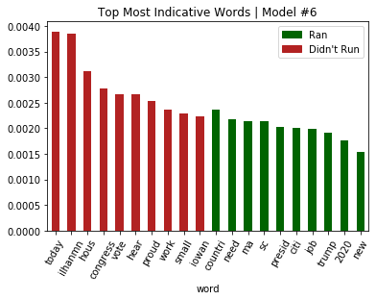

```{r, include=FALSE}
# set global options
knitr::opts_chunk$set(echo = FALSE, message = FALSE, warning = FALSE)
```

# Introduction

The history of the Office of the President of the United States began in 1787 with the Constitutional Convention and has evolved over time through precedent, tradition, and, at times, Constitutional amendment. The forty-five Presidents have come from five political parties in total but with most of them being either Republicans or Democrats. These are the same two parties that have existed since 1854 and 1828, respectively, with gradual transformation over time and an ideological reversal between the 1930s and the 1960s surrounding Franklin D. Roosevelt’s New Deal and passage of the Civil Rights Act during Lyndon B. Johnson’s tenure (Republican National Committee, n.d.; Office of Art & Archives, n.d.; Little, 2017).

Sixty percent of Presidents have served only one term with most others having served two consecutive terms with only two exceptions: Grover Cleveland, who served two non-consecutive terms; and Franklin Roosevelt, who was elected and served for three terms, as the 22nd Amendment to the Constitution, which allows a President to serve for at most two terms, was not passed until 1947 and was not ratified until 1951 (Encyclopaedia Britannica, 2019). Most Presidents have had some prior experience serving in a public office, and of those who have not, only one did not serve in the military. There have also been several academics and farmers or plantation owners who were elected. Almost all Presidents have been White except Barack Obama, the 44th President, and all have been men. While the youngest age at which a person is eligible to run for President is 35 years old, the youngest person to be elected was Theodor Roosevelt at age 42. The oldest President at the time of election is Donald Trump, who was 70 years old at the time.

In terms of modern Presidential elections, the last three—2008, 2012, and 2016—have been exceptionally unique to one another. Since George W. Bush had served for two terms, there was no incumbent in 2008, leading to a relatively balanced field of candidates on both sides with ten Democratic candidates and 12 Republicans. In 2012, after the first Obama term, Republicans saw an opportunity to defeat an incumbent they viewed as deeply flawed, so there were ultimately thirteen Republican primary candidates and only four Democratic primary challengers. Again in 2016, there was no incumbent on either side, but Hillary Clinton had been a strong primary candidate in 2008 and served as Obama’s Secretary of State in the meantime, so she was seen by many as the presumptive Democratic Party nominee, although there were a handful of other primary candidates, including Senator Bernie Sanders. On the other hand, the Republican Party seemed to be looking for a unique candidate unlike those who had lost to Obama in 2008 and 2012, so there were seventeen officially declared candidates, from which Donald Trump emerged victorious. Now in the 2020 races, Donald Trump is a strong but divisive candidate for Republicans so challengers are few and far between, but for the same reasons, there was an even broader field than 2016 Republicans, with 29 Democratic candidates officially announcing their campaigns.

Following candidates on the primary campaign trail is an increasingly expensive endeavor for news organizations, as the deadlines are short, and the number of staff required is inflated with each additional candidate. Thus, it would be desirable for news organizations (and other invested parties) to be able to accurately predict who will be declaring candidacy before any announcements take place.


# Analysis and Models

## About the Data

On May 24th, over 300,000 tweets originating from 109 Twitter handles were extracted using the Tweepy library API. The handles used belong to the 2020 Presidential primary candidates from both major parties, where available, and a sampling of non-candidates, mostly consisting of well-known political figures or previous Presidential primary candidates, the lists of which were collected manually from publically available online sources, such as Ballotpedia.

###### Fig.1 Sample of People


These sources were used to determine which individuals announced their candidacy to run for President of the United States in 2020, the date of the announcements, and other attributes. Each observation represents dimensional data specific to a person, including both candidates and non-candidates, such as political affiliations, as shown in proportions below.

###### Fig.2 Party Proportion


The majority of individuals in the data set are members of either the Democratic Party, followed by the Republican Party. The single Independent exception is Senator Bernie Sanders, who caucuses with the Democratic Party, and has run for President in the Democratic primary twice, in 2016 and in 2020.

In addition to party affiliation, the data set includes the state in which a person is primarily politically active.

###### Fig.3 States Proportion


The top five states are Massachusetts, New York, California, Texas, and Florida.

The following table shows an aggregation of key attributes by political party.

###### Fig.4 Key Attributes by Party


The majority of those who ran in 2020 were Democrats, contrasting with a Republican majority in the 2016 campaign.

The following plot compares party affiliation to prior political roles (i.e., state governor, U.S. Senator, U.S. Representative). Note that many people have held more than one of these positions, so the sum across roles will be greater than the total number of unique individuals who have held at least one of these positions.

###### Fig.5 Party Affiliation by Government Role


Most of the Democrats come from House or Senate roles, whereas Republicans come from House or governor roles.

There are fourteen individuals in the data that did not hold any of these roles, although some have held other local, state, or federal roles not specified, while still others have held positions only in the private sector.

###### Fig.6 Individuals from Other Government / Business Roles


The original tweets collected from Twitter were formatted as JSON, filtered for english language, and subset to include just the text and creation dates. A total of 308,423 tweets were collected across 109 Twitter handles.

Altogether the tweets were created over a period of several years, as shown in the distribution below, aggregated by tweet date.

###### Fig.7 Tweets Created Over Time


The tweets in this data set were mostly created between 2018 and 2020, although, due to the constraints of the Twitter API, it is impossible to distinguish between natural increases in Tweet volume over time and increased availability to more recent Tweets allowed by the collection API itself.

###### Fig.8 Top 10 Candidates by Number of Tweets


As a result of querying for all available tweets from each user’s Twitter timeline, there are approximately 3000 tweets per individual. A minimum of 8 tweets per individual were collected and a maximum of 3226, as shown in Figure 8.

###### Fig.9 All Presidential Candidate Tweet Counts


###### Fig.10 All Non-Candidate Tweet Counts


The tweet text was analyzed by candidates and non-candidates to assess for any noticeable differences. Methods for comparison included:

* corpus statistics of the tweet text
* term frequency
* sentiment
* part-of-speech

The following transformations / cleaning were applied to the tweet text:

* stopwords removed
* removed links, hashtags, mentions, and converted to lowercase
* alphabetic words only

###### Fig.11 Candidate Tweets: Corpus Statistics


###### Fig.12 Non-Candidate Tweets: Corpus Statistics


There were no substantial differences between candidate and non-candidate tweets in terms of overall text statistics in both the observation (i.e. tweet) and corpus level.

###### Fig.13 Candidate Tweets: Term Frequency


###### Fig.14 Candidate Tweets: Word Cloud


###### Fig.15 Non-Candidate Tweets: Term Frequency


###### Fig.16 Non-Candidate Tweets: Word Cloud


Term frequency distributions show a stark contrast between candidate and non-candidate tweets. The former shows a far smoother inflection in its term frequency distribution, whereas the latter exhibits a steep drop off in counts within the top three words.

Candidate tweets contain the following high-frequency terms in higher proportions than non-candidate tweets:

* today | trump | people | president | new | us | need | great

Non-candidate tweets contain the following words in greater proportion:

* support | vote | proud

Very few top terms really distinguished candidates and non-candidates. Similar top terms are used by both. Distinction between classes may come via common function words (i.e. some stopwords) and patterns of less frequent words.

###### Fig.17 Candidate Tweets: Sentiment Polarity


###### Fig.18 Candidate Tweets: Sentiment Proportion


###### Fig.19 Non-Candidate Tweets: Sentiment Polarity


###### Fig.20 Non-Candidate Tweets: Sentiment Proportion


The distribution of polarity and proportion of sentiment between candidates and non-candidates were similar with little difference. Non-candidates wrote slightly more positive tweets, and candidates wrote slightly more negative tweets. Overall, there was not much difference.

###### Fig.21 Candidate Tweets: Part-of-Speech


###### Fig.22 Non-Candidate Tweets: Part-of-Speech


Overall differences in part-of-speech between candidate and non-candidate tweets appeared negligible. Non-candidate tweets contained more nouns and adjectives, and candidate tweets contained more verbs and adverbs.

At an aggregate and without concern for when tweets were created, a hierarchical clustering model would demonstrate whether a collection of tweets can distinguish candidates from non-candidates.

###### Fig.23 Dendrogram of Users


From an aggregate perspective, two clusters were distinctly identifiable, and tweets from candidates (green labels) were mostly clustered together. Likewise, tweets from non-candidates (red labels) typically clustered with other non-candidates. There were a number of exceptions:

Non-candidates (red labels) in the candidates (green) cluster (21):

* SenSchumer
* SenMarky
* HillaryClinton*
* keithellison
* PramilaJayapal
* IlhanMN
* MartinOMalley*
* lessig*
* GovMikeHuckabee*
* RandPaul*
* RepThomasMassie
* ScottWalker*
* marcorubio*
* JimWebbUSA*
* tedcruz*
* TedYoho
* GovHowardDean
* RepGosar
* MarkMeadows
* LindseyGrahamSC*
* RepAlGreen


Candidates (green labels) in the non-candidates (red) cluster (3):

* MauriceGravel
* WayneMessam
* MarkSanford

*Ran in a 2016 primary

There were many more false positives (non-candidates grouped in the candidate cluster) than false negatives (candidates grouped in the non-candidate cluster), although many of those false positives—48%, in fact—were primary candidates in 2016, thus implying that there is a time-sensitive element in how a person Tweets once they have decided to run for President, as the data upon which this analysis is based included tweets from when those 2016 primary candidates would have been running as well.

Top terms in each cluster were identified using mean term frequency.

###### Fig.24 Top Features: Candidates Cluster


###### Fig.25 Top Features: Non-Candidates Cluster


Top terms that best distinguish clusters were identified using the F-statistic on the mean difference in groups.

###### Fig.26 Top Distinctive Terms for Clustering


## Models

Numerous models were created using several different approaches for configuring the data. A limited amount of initial preprocessing was required, as the vectorizer functions were leveraged to do the majority of the cleaning. Web addresses, retweets (“rt”), and ampersands (“amp”) were removed from the text.

The initial strategy was to model all the Tweets from 2018, which would represent a fixed window to limit bias by evaluating Tweets before the majority of candidates had announced their campaigns. However, based on the API limitations of Twitter, this strategy proved difficult, as most of the Tweets came from 2019 & 2020 (Figure 7). In addition, the total number of allowed Tweets per handle appeared to be limited (Figure 8).

### Strategy 1: API Balancing & Bias Mitigation

To limit the number of Tweets used after 2018, the first set of models took all of the Tweets from 2018 for both 2020 primary candidates and non-candidates. For those with no records in 2018 (either because they didn’t Tweet or the number of Tweets pulled was limited), the remaining collection of Tweets was grouped by handle then sorted by date. The median value of Tweets per handle from 2018 was calculated (198 Tweets), then up to the first 198 Tweets per handle were pulled from the non-2018 collection so that the number of Tweets was balanced between candidates and non-candidates. Each handle was then aggregated to contain one corpus per handle, which resulted in 34 and 75 handles for candidates and non-candidates, respectively. To ensure interclass balance, a random sample of 34 non-candidates was selected. Finally, the candidates and non-candidates were merged into a single dataframe. Figure 27 below provides a diagram of this data strategy. The resulting data frame contained 68 individual handles with an approximate collective 25,000 Tweets. The benefit of this method was ensuring interclass balance, a similar number of Tweets per handle, and a timeframe as close to 2018 as possible, when candidates would be deciding whether or not to run but prior to making their announcements. However, the cost of this method was significant downselecting of Tweets from the original dataset, which may lead to degraded model results. 

###### Fig.27 Flow of data for the first set of models


#### Model 1

The first model within this set used CountVectorizer with default settings to represent a base model. This resulted in a term document matrix of over 23,000 features across the 68 handles. As previously mentioned, CountVectorizer performs the majority of preprocessing, including removing special characters, punctuation, and tokenization. The data was then split into training and test sets at 70% and 30%, respectively. A multinomial Naïve Bayes (MNB) model with a Laplace of 1 was instantiated as the classifier. The model was trained and predicted on the test set with 5-fold cross validation. 

#### Model 2

The second model within this set also used CountVectorizer, this time adding Porter Stemmer with the intent of combining similar words within the data to provide more informative features. Stopwords were also removed to reduce noise. Lastly, after trying several combinations of other parameters (e.g. bigrams, trigrams, max document frequency, etc.), a minimum document frequency of 10% was set. The resulting term document matrix reduced from over 23,000 to 2,200 features. Again, the data was then partitioned with 70% training and 30% testing with a MNB model containing a Laplace of 1. The model was trained and predicted on the test set with 5-fold cross validation. 

#### Model 3

The third model was based on the same term document matrix as the second model above, but this time used a Support Vector Machine (SVM) as the classifier. A grid search was performed on the training dataset to find the best parameters. Figure 28 shows the various parameters that were tested, resulting in 1,350 trials overall. The bolded blue text represents the best-performing combination. The model was then trained based on these parameters and predicted using 5-fold cross validation on the test dataset.

###### Fig.28 Model #3 | SVM Grid Search Parameters


Other models were tried under this approach but excluded from this report due to poor results. Some of these variations include the use of TfidfVectorizer, removing any non-alphabetic characters (e.g. numbers), n-grams, and setting maximum document frequencies. 

### Strategy 2: All Tweets through Last Announcement

The second set of models used a more relaxed the date strategy compared to the first approach. This second approach used all the Tweets that were posted on or before November 24, 2019, which is the date of the last campaign announcement for the 2020 election. This resulted in a collection of over 230,000 Tweets rather than the 23,000 Tweets used in the first method. Like the first set, web addresses, retweets, and ampersands were removed from the text. In addition, the Tweets were grouped so that each observation contained the aggregated text by handle. This resulted in 104 observations, composed of 30 candidates and 74 non-candidates. A few members of each group were omitted since their Twitter handles returned no Tweets from dates prior to the dataset cutoff. The benefit to this approach is the substantial increase in the number of Tweets added to the corpus, bringing the average number of Tweets per handle to more than 2,200; however, the cost is an increase in data leakage that might occur when Tweets that occur after a campaign announcement are included, especially Tweets occurring on the day of each candidate’s announcement, which would intuitively contain obvious indicators in this problem. In addition, complications may arise when having unbalanced classes.

#### Model 4

The fourth model mimicked the first model above in that it was treated as a base model containing default parameters of the CountVectorizer function. This resulted in more than 115,000 unique features. Similar to the previous models, the data was split into training and test sets at a 70:30 split, although, this time the splitting used a stratified approach so that proportional relationship between the classes remained the same between the training and test datasets in an attempt to mitigate the complications of having imbalanced classes. This model utilized a MNB classifier with a Laplace value of 1.

#### Model 5

The fifth model copied the second model above regarding the vectorization parameters. This provided a term document matrix containing 7,700 features. To remain consistent with the previous model, a stratified splitting method was used at 70% train and 30% test. This model also utilized a MNB classifier with a Laplace value of 1.

#### Model 6

The sixth model used the vectorized train/test data from the fifth model. It also followed the third model and performed a grid search over SVM parameters. Figure 29 shows the attempted parameters with the best combination in bolded blue text. Interestingly, this model performed better with a linear kernel and low cost as opposed to the non-linear and higher cost combination of the third model. For an advanced and summarized look, Figure 47 at the end of the results section shows a list of models with parameter values and results for each.

###### Fig.29 Model #6 | SVM Grid Search Parameters


# Results

### Strategy 1

#### Model 1

The first (base) model provided better than expected results, given the lack of tuning parameters and reduced amount of data. The 5-fold cross validation on testing data resulted in 75% accuracy. Examining a sample fold, as in Figure 30, demonstrates that the model struggles to predict the candidates who did not run, resulting in many false positives (predicting that a person would launch a campaign when they did not). Of course, the result may be reversed in another fold, showing many false negatives (predicting that a person would not launch a campaign when they did).

###### Fig.30 Model #1 | Confusion Matrix of an Example Fold


Looking at the receiver operating characteristic (ROC) curve in Figure 31 for this same fold, a similar story is visible. Once again, the model is showing better performance for predicting those who actually ran with an area under the curve (AUC) of 0.91 versus those who did not (AUC = 0.74).

###### Fig.31 Model #1 | ROC Curve of an Example Fold


Figure 32 shows the top 10 most indicative words for each class. The values here are expressed in plain odds, meaning that every time the word “the” is used in a Tweet, the chance of that person being predicted to launch a campaign based on the Tweet increases by about 4%. It is interesting to note that the odds of the top words for those who ran are substantially higher than the odds of those who did not. Additionally, stop words appear to make up the majority of the top words, which indicates that there may be a substantial amount of noise in the predictions.

###### Fig.32 Model #1 | Top Most Indicative Words


#### Model 2

The second model saw an increase in the 5-fold cross validation accuracy to 80%. Again, looking at the outcome of a sample fold in Figure 33 reveals that the model struggles with non-candidates, although not as much as Model 1.

###### Fig.33 Model #2 | Confusion Matrix of an Example Fold


The ROC curve in Figure 34 for this same fold shows a similar (and possibly better) story, with both AUCs greater than 0.90. Once again, the model is showing better performance for predicting those who actually ran (AUC = 0.96) versus those who did not (AUC = 0.92), although the values are closer to each other than before.

###### Fig.34 Model #2 | ROC Curve of an Example Fold


Since stop words were removed, the most indicative words were quite different from those in Model 1 (Figure 35). In addition, the probabilities of the words between the two classes are now much more similar to each other. Many of the words from the hierarchical clustering differentiation appear here, such as “today”, “thank”, and “great” among those who were predicted to not run, and “trump”, “need”, and “peopl” (stemmed from “people”) among those who were predicted to run.

###### Fig.35 Model #2 | Most Indicative Words


#### Model 3

The third model, which used the same data as Model 2 but with an SVM classifier regressed in performance. The 5-fold cross validation on testing data was 76%, a slight decrease compared to the previous model. In fact this classifier was closer in performance to the first model (Figure 36). 

###### Fig.36 Model #3 | Confusion Matrix of an Example Fold


Once again, the model performed better at predicting those who ran, and incorrectly predicted those who did not. The AUC of those who ran is 0.86, as shown in Figure 37.

###### Fig.37 Model #3 | ROC Curve of an Example Fold


Overall, in the first set of models, the second model, containing the MNB model with stopwords removed, stemmed features, and a minimum document frequency of 10% performed the best. See Figure 47 for a tabular view of the various models and their performance.

### Strategy 2

#### Model 4

Turning to the second set of models, which used the increased number of Tweets, the fourth model with base parameters saw an increase in performance compared to the first model with a 5-fold cross validation F1 score of 80%. Thus, having the broader corpus from the larger pool of Tweets appears to provide an increase in accuracy of six percentage points over the first model. The confusion matrix and classification report in Figure 38 show that the MNB model does well in predicting the cases where a campaign was not launched, resulting in fewer false positives. The F1 measure of the “didn’t run” class is 91%, a significant improvement over previous models. The F1-score is being used in this second set of models due to the unbalanced nature of the classes.

###### Fig.38 Model #4 | Confusion Matrix & Classification Report of an Example Fold


The AUCs (Figure 39) for the two classes are not only close to each other but they are also around 0.90, suggesting good model performance based on the MNB classifier.

###### Fig.39 Model #4 | ROC Curve


The most indicative words for the fourth model in Figure 40 show a general split compared to the most indicative words from the first model. Besides the first two words (“the” and “to”), both classes roughly have the same odds. 

###### Fig.40 Model #4 | Most Indicative Words


#### Model 5

The fifth model saw a significant increase in performance with a 5-fold cross validation testing F1 measure of 92% for the “ran” class. Removing stop words, stemming, and setting a minimum threshold for document frequency performed well on the larger dataset and was able to reduce a significant amount of noise. Figure 41 shows the sample confusion matrix and classification report. Those who ran were predicted perfectly (100% recall), whereas those who did not run were predicted correctly 21 out of 23 times (91% recall). Both of these values represent an improvement over any of the other models.

###### Fig.41 Model #5 | Confusion Matrix & Classification Report of an Example Fold


These high performance scores also correspond with the AUC values found in the ROC curve (Figure 42). The true and false positive rates almost perfectly follow the graphical boundaries as desired, suggesting that the MNB classifier performed extremely well and has learned the data.

###### Fig.42 Model #5 | ROC Curve


Figure 43 below shows the top most indicative words for both classes. The probabilities are fairly balanced between the two classes with “today” having the single highest value overall. “Thank” and “great” are the next two highest for the “didn’t run” class. “Need”, “peopl” (stemmed), and “trump”, again, are the three highest valued words for the “ran” class, meaning the more times these words were used, the more likely they were to launch a campaign.

###### Fig.43 Model #5 | Most Indicative Words


#### Model 6

The sixth and final model used SVM and saw a decrease in performance compared to Model 5 above. The 5-fold cross validation testing F1-score was 67%. Figure 44 below shows the corresponding confusion matrix and classification report for this model, demonstrating that the model generally does not perform as well as previous models. 

####### Fig.44 Model #6 | Confusion Matrix & Classification Report of an Example Fold


There was also a slight dropoff from accuracy (91%) to AUC (87%) in this sixth model as well, although the performance is still high. Figure 45 shows the ROC curve for this model.

####### Fig.45 Model #6 | ROC Curve


The most indicative words for this model are shown in Figure 46. Unlike previous models, this list contains several different top words. Generally, if the words “today”, “house”, “congress”, and “vote” appear, that person is less likely to run for president, according to the model. On the other hand, if the words “country”, “need”, and “president” appeared, one was more likely to launch a campaign. Note that because these words are stemmed, some of them seem nonsensical. It is also important to note that “2020” appears in the “ran” class, which is a strong indicator of potential data leakage in the model.

###### Fig.46 Model #6 | Most Indicative Words


###Model Summary

Although the fifth model performed the best in terms of accuracy score, it also contained one of the greatest amounts of leakage due to the data strategy of including Tweets through the last candidate’s announcement date, meaning that the results may be spurious and potentially inapplicable in a future test scenario where no one has yet announced a campaign but decisions still must be made based on the model’s predictions.

With that in mind, the second model performed relatively well with a much lower amount of data leakage. This model was able to learn the patterns and trends in the data and accurately predict the test cases with a fair amount of confidence without the risk of having used Tweets to make a prediction after a candidate had already announced. Thus, it is recommended that this model is used, despite its lower score. Figure 47 below shows the various combinations of models, including their results. The selected model is bolded in blue.

###### Fig.47 Summary of Models & Parameters


# Conclusion

Evidenced above, it is clear that a Presidential candidacy can be predicted to some reliable degree based solely on Tweet content. Furthermore, since time-ignorant models often include candidates from prior election cycles as false positives for the current cycle, it is suggested that a Presidential candidate does not always Tweet like a candidate. In fact, the analysis indicates that at some point leading up to the announcement, the person begins using different mannerisms when Tweeting, likely at the time the person starts to consider a bid. While the limitations of the Tweet extraction process limit the precision with which this time frame can be identified, and it likely varies from candidate to candidate, there is certainly sufficient evidence to suggest at least that it exists.

This candidential manner of tweeting includes frequent mention of “President” “Trump” and what the “people” might “need” in a future “President” and differs from the manner of their political peers, who mostly tweet about more agreeable topics such as “thanks”, “join” and “support”. This differentiation remains relatively consistent regardless of model, further strengthening the differentiative evidence. Although the lexicon of future candidates’ tweets will likely evolve between election cycles, the current President, incumbent or otherwise, would be a staple of differentiation, as presidential hopefuls would be more likely than anyone else to specifically celebrate or criticize the job performance of their predecessor rather than the party in general, in an attempt to draw either a comparison or a contrast, depending on the President’s national approval rating and relation to the candidate’s own party.

Ultimately, the identification of candidates is achievable with Tweet data prior to the campaign announcements, but other sources of data should be examined for their predictive capacities as well, including the attributes of past Presidents discussed above, such as political party, incumbency, professional experience, race, gender, and age. These attributes would help not only in a technical sense, but also in an intuitive one, as a model predicting that the most freshman Representatives will be running in the next cycle, is likely ill-informed, as they could be up to ten years away from eligibility.

# Works Cited

* Ballotpedia. (n.d.). List of current members of the U.S. Congress. Retrieved 04 25, 2020, from Ballotpedia: [https://ballotpedia.org/List_of_current_members_of_the_U.S._Congress](https://ballotpedia.org/List_of_current_members_of_the_U.S._Congress)
* Ballotpedia. (n.d.). Roque De La Fuente presidential campaign, 2020. Retrieved 04 25, 2020, from Ballotpedia: [https://ballotpedia.org/Roque_De_La_Fuente_presidential_campaign,_2020](https://ballotpedia.org/Roque_De_La_Fuente_presidential_campaign,_2020)
* Ballotpedia. (n.d.). Timeline of announcements in the presidential election, 2016. Retrieved 04 25, 2020, from Ballotpedia: [https://ballotpedia.org/Timeline_of_announcements_in_the_presidential_election,_2016](https://ballotpedia.org/Timeline_of_announcements_in_the_presidential_election,_2016)
* Ballotpedia. (n.d.). Timeline of announcements in the presidential election, 2020. Retrieved 04 25, 2020, from Ballotpedia: [https://ballotpedia.org/Timeline_of_announcements_in_the_presidential_election,_2020](https://ballotpedia.org/Timeline_of_announcements_in_the_presidential_election,_2020)
* Burke, M. (2019, 03 13). Democratic Florida mayor launching 2020 presidential exploratory committee. Retrieved 04 25, 2020, from The Hill: [https://thehill.com/homenews/campaign/433890-democratic-florida-mayor-launching-2020-presidential-exploratory-committee](https://thehill.com/homenews/campaign/433890-democratic-florida-mayor-launching-2020-presidential-exploratory-committee)
* Jackson, D. (2015, 05 27). Santorum officially begins 2016 presidential campaign. Retrieved 04 25, 2020, from USA Today: [https://www.usatoday.com/story/news/politics/elections/2016/2015/05/27/rick-santorum-2016-presidential-race/28011791/](https://www.usatoday.com/story/news/politics/elections/2016/2015/05/27/rick-santorum-2016-presidential-race/28011791/)
* Little, B. (2017, 08 18). How the 'Party of Lincoln' Won Over the Once Democratic South. Retrieved 06 02, 2020, from History: [https://www.history.com/news/how-the-party-of-lincoln-won-over-the-once-democratic-south](https://www.history.com/news/how-the-party-of-lincoln-won-over-the-once-democratic-south)
* Merica, D., Alesci, C., & Tapper, J. (2019, 11 24). Michael Bloomberg is the latest 2020 Democratic hopeful. Retrieved 04 25, 2020, from CNN: [https://www.cnn.com/2019/11/24/politics/michael-bloomberg-2020-election/index.html](https://www.cnn.com/2019/11/24/politics/michael-bloomberg-2020-election/index.html)
* Office of Art & Archives. (n.d.). Party Realignment And The New Deal. Retrieved 06 02, 2020, from History, Art & Archives: United States House of Representatives: [https://history.house.gov/Exhibitions-and-Publications/BAIC/Historical-Essays/Keeping-the-Faith/Party-Realignment--New-Deal/](https://history.house.gov/Exhibitions-and-Publications/BAIC/Historical-Essays/Keeping-the-Faith/Party-Realignment--New-Deal/)
* Republican National Committee. (n.d.). Founding of the Republican Party. Retrieved 06 02, 2020, from GOP: [https://www.gop.com/history/](https://www.gop.com/history/)
* The Editors of Encyclopaedia Britannica. (2019, 07 17). Presidents of the United States. Retrieved 06 02, 2020, from Encyclopædia Britannica: [https://www.britannica.com/topic/Presidents-of-the-United-States-1846696](https://www.britannica.com/topic/Presidents-of-the-United-States-1846696)
* United States Senate. (n.d.). Living Former Senators (Alphabetical. Retrieved 04 25, 2020, from United States Senate: [https://www.senate.gov/senators/Biographical/former_senators_alphabetical.htm](https://www.senate.gov/senators/Biographical/former_senators_alphabetical.htm)
* United States Senate. (n.d.). Senators of the 116th Congress. Retrieved 04 25, 2020, from United States Senate: [https://www.senate.gov/general/contact_information/senators_cfm.cfm?Class=1](https://www.senate.gov/general/contact_information/senators_cfm.cfm?Class=1)
* Wikipedia. (n.d.). List of current United States governors by age. Retrieved 04 25, 2020, from Wikipedia: [https://en.wikipedia.org/wiki/List_of_current_United_States_governors_by_age](https://en.wikipedia.org/wiki/List_of_current_United_States_governors_by_age)
* Wikipedia. (n.d.). List of former members of the United States House of Representatives. Retrieved 04 25, 2020, from Wikipedia: [https://en.wikipedia.org/wiki/List_of_former_members_of_the_United_States_House_of_Representatives](https://en.wikipedia.org/wiki/List_of_former_members_of_the_United_States_House_of_Representatives)
* Wikipedia. (n.d.). List of living former United States governors. Retrieved 04 25, 2020, from Wikipedia: [https://en.wikipedia.org/wiki/List_of_living_former_United_States_governors](https://en.wikipedia.org/wiki/List_of_living_former_United_States_governors)
* WSAZ News Staff. (2018, 11 11). Former W.Va. Sen. Richard Ojeda pulls out of U.S. presidential race. Retrieved 04 25, 2020, from WSAZ3 News Channel: [https://www.wsaz.com/content/news/State-Senator-Richard-Ojeda-to-run-for-President-in-2020-500248782.html](https://www.wsaz.com/content/news/State-Senator-Richard-Ojeda-to-run-for-President-in-2020-500248782.html)
